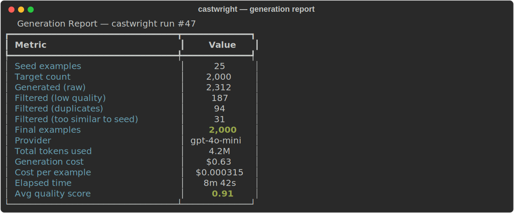

# castwright

[](https://github.com/stef41/castwright/actions/workflows/ci.yml)
[](https://www.python.org/downloads/)
[](https://opensource.org/licenses/Apache-2.0)

**Generate synthetic instruction-tuning data that doesn't look synthetic.**

castwright takes a handful of seed examples and produces thousands of new instruction-output pairs using any LLM API. It handles the annoying parts — prompt engineering, JSON parsing, deduplication, quality filtering — so you can focus on the model you're actually training.

<p align="center">
  
</p>

```python
from castwright import generate, load_seeds, save_results, GenerationConfig
from castwright import OpenAIProvider

seeds = load_seeds("seeds.jsonl")
provider = OpenAIProvider(model="gpt-4o-mini")

result = generate(seeds, provider, GenerationConfig(n=500, temperature=0.9))
save_results(result, "training_data.jsonl")
print(f"Saved {len(result.examples)} examples ({result.n_filtered} filtered)")
```

## Why castwright?

Building a fine-tuning dataset by hand is slow. Getting an LLM to generate training data sounds easy until you deal with:

- Refusals showing up in your training set
- Repetitive examples that add nothing
- Models talking about generating data instead of actually doing it
- Raw JSON extraction from markdown blocks
- Deduplication against your seeds so the model doesn't just copy them

distilabel tried to solve this but became a pipeline framework. Alpaca_eval is evaluation-only. Self-instruct is a research repo, not a library.

castwright is the missing middle ground: a pip-installable library with a clean API, built-in quality filters, and output in every format fine-tuning frameworks expect.

**What you get:**

- Pluggable LLM backends: OpenAI, Anthropic, or any OpenAI-compatible API
- Six fast heuristic filters that catch bad generations before they hit your training set
- Automatic dedup against your seed data
- Output in Alpaca, ShareGPT, or OpenAI chat format
- Multi-turn conversation generation
- A CLI for quick generation runs without writing Python
- Zero required dependencies (provider SDKs are optional extras)

## Install

```bash
pip install castwright
```

With OpenAI support:

```bash
pip install castwright[openai]
```

With Anthropic support:

```bash
pip install castwright[anthropic]
```

Everything (both providers + CLI):

```bash
pip install castwright[all]
```

## Seed file format

Create a JSONL file with your seed examples. You need at least a few good ones — castwright uses them to teach the LLM what you want:

```jsonl
{"instruction": "Explain the difference between TCP and UDP", "output": "TCP is a connection-oriented protocol that guarantees delivery..."}
{"instruction": "Write a Python function to flatten a nested list", "output": "def flatten(lst):\n    result = []\n    for item in lst:\n        if isinstance(item, list):\n            result.extend(flatten(item))\n        else:\n            result.append(item)\n    return result"}
{"instruction": "What causes a segfault?", "input": "In C/C++ programs", "output": "A segmentation fault occurs when a program tries to access memory..."}
```

Also accepts JSON arrays and `prompt`/`response` field names.

## Usage

### Basic generation

```python
from castwright import generate, GenerationConfig, Seed
from castwright import OpenAIProvider

seeds = [
    Seed(instruction="Explain recursion", output="Recursion is when a function calls itself..."),
    Seed(instruction="What is a hash table?", output="A hash table is a data structure that maps keys to values..."),
]

provider = OpenAIProvider(model="gpt-4o-mini")
config = GenerationConfig(n=100, temperature=0.9, diversity_factor=0.7)

result = generate(seeds, provider, config)
print(f"Generated: {result.n_generated}, Filtered: {result.n_filtered}, Kept: {len(result.examples)}")
```

### Output formats

```python
from castwright import save_results, OutputFormat

# Alpaca format (default) — works with axolotl, LLaMA-Factory
save_results(result, "data.jsonl", OutputFormat.ALPACA)

# ShareGPT format — works with FastChat, LLaMA-Factory
save_results(result, "data.jsonl", OutputFormat.SHAREGPT)

# OpenAI chat format — works with OpenAI fine-tuning API
save_results(result, "data.jsonl", OutputFormat.OPENAI)
```

### Multi-turn conversations

```python
from castwright import generate_multiturn, Seed
from castwright import OpenAIProvider

seeds = [Seed(instruction="Help me debug this Python code", output="Let me look at that...")]
provider = OpenAIProvider()

result = generate_multiturn(seeds, provider, n=50, turns=4)
```

### Custom providers

Any OpenAI-compatible API works out of the box:

```python
from castwright import OpenAIProvider

# vLLM, Ollama, Together, etc.
provider = OpenAIProvider(
    model="meta-llama/Llama-3-70B-Instruct",
    base_url="http://localhost:8000/v1",
    api_key="not-needed",
)
```

### Quality filters

castwright applies six filters by default:

| Filter | What it catches |
|--------|----------------|
| `not_empty` | Blank instruction or output |
| `min_length` | Instructions shorter than 10 characters |
| `not_repetitive` | Output with >30% consecutive word repeats |
| `not_refusal` | "I'm sorry, I can't..." responses |
| `no_meta_talk` | "Here's an example..." meta-commentary |
| `balanced_formatting` | Unclosed code blocks |

You can also pass your own:

```python
from castwright import filter_examples, GeneratedExample

def my_filter(ex: GeneratedExample) -> bool:
    return len(ex.output) > 100

filtered = filter_examples(result.examples, filters=[my_filter])
```

### Generation config

```python
GenerationConfig(
    n=100,                    # Number of examples to generate
    model="gpt-4o-mini",     # Model name (passed to provider)
    temperature=0.9,          # Sampling temperature (0.0-2.0)
    max_retries=3,            # Retries on parse failure
    diversity_factor=0.7,     # 0.0=similar to seeds, 1.0=very diverse
    output_format=OutputFormat.ALPACA,
)
```

## CLI

```bash
# Generate from seed file
castwright gen seeds.jsonl -n 200 -m gpt-4o-mini -o output.jsonl --provider openai

# Use Anthropic
castwright gen seeds.jsonl -n 100 -m claude-sonnet-4-20250514 -o output.jsonl --provider anthropic

# Preview your seed examples
castwright preview seeds.jsonl

# Test without API calls
castwright gen seeds.jsonl -n 10 -o test.jsonl --provider mock
```

## Comparison with alternatives

| | castwright | distilabel | self-instruct | manual |
|---|---|---|---|---|
| pip install | yes | yes | clone repo | - |
| Simple API | 3 lines | pipeline DSL | scripts | - |
| Quality filters | built-in | separate step | none | human |
| Multi-provider | OpenAI, Anthropic, any compatible | varies | OpenAI only | - |
| Format output | Alpaca, ShareGPT, OpenAI | custom | Alpaca | any |
| Maintained | active | founders left | archived | - |

## See Also

Part of the **stef41 LLM toolkit** — open-source tools for every stage of the LLM lifecycle:

| Project | What it does |
|---------|-------------|
| [tokonomics](https://github.com/stef41/tokonomix) | Token counting & cost management for LLM APIs |
| [datacrux](https://github.com/stef41/datacruxai) | Training data quality — dedup, PII, contamination |
| [datamix](https://github.com/stef41/datamix) | Dataset mixing & curriculum optimization |
| [toksight](https://github.com/stef41/toksight) | Tokenizer analysis & comparison |
| [trainpulse](https://github.com/stef41/trainpulse) | Training health monitoring |
| [ckpt](https://github.com/stef41/ckptkit) | Checkpoint inspection, diffing & merging |
| [quantbench](https://github.com/stef41/quantbenchx) | Quantization quality analysis |
| [infermark](https://github.com/stef41/infermark) | Inference benchmarking |
| [modeldiff](https://github.com/stef41/modeldiffx) | Behavioral regression testing |
| [vibesafe](https://github.com/stef41/vibesafex) | AI-generated code safety scanner |
| [injectionguard](https://github.com/stef41/injectionguard) | Prompt injection detection |

## License

Apache-2.0
